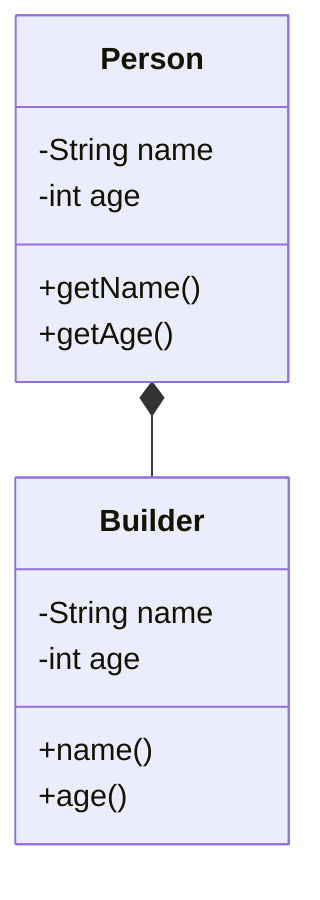

# java-builder-fluency
Builder Fluency Pattern

## Person Class & Builder

```mermaid
classDiagram
     Person *-- Builder
     Person : -String name
     Person : -int age
     Person : +getName()
     Person : +getAge()
     class Builder {
         -String name
         -int age
         +name()
         +age()
     }
```

## Example
```java
  Person john = new Person.Builder()
      .name("John Smith")
      .age(35)
      .build();
```
